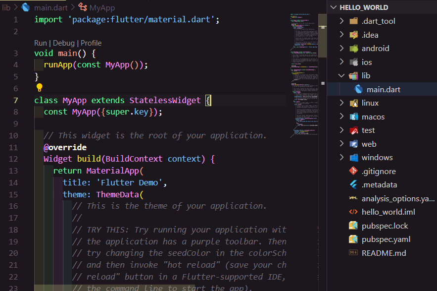

## Mochammad Cholilur Rokhman

## 2241720033 (15)

## TI-3H

### Praktikum 1: Membuat Project Flutter Baru

### Praktikum 2: Menghubungkan Perangkat Android atau Emulator

### Praktikum 3: Membuat Repository GitHub dan Laporan Praktikum

#### Langkah 10

#### Langkah 11

#### Langkah 12

### Praktikum 4: Menerapkan Widget Dasar

#### Langkah 1

#### Langkah 2

### Praktikum 5: Menerapkan Widget Material Design dan iOS Cupertino

#### Langkah 3: Scaffold Widget

#### Langkah 4: Dialog Widget

Tampilan Awal :

Jika klik show alert :

Jika diklik ok maka alertnya akan hilang

#### Langkah 5: Input dan Selection Widget

#### Langkah 6: Date and Time Pickers

Tampilan Awal :

Jika diklik pilih Tanggal : 

